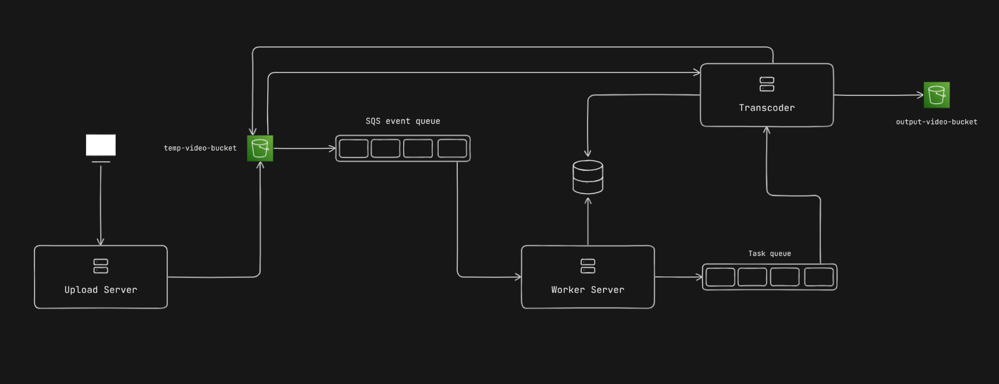

# Video Transcoding Pipeline

This project is a backend-only video transcoding pipeline that handles video uploads, transcoding, and storage. It uses S3 for video storage, SQS for event-driven processing, and PostgreSQL for metadata and status tracking. The pipeline is designed to be scalable and efficient.

## Architecture Overview

### Workflow

1. **Upload Server:**
   - Accepts video uploads from clients.
   - Uploads the video to an S3 bucket (`temp-video-bucket`).

2. **S3 (temp-video-bucket):**
   - Stores the uploaded video.
   - Triggers an SQS event when a new video is uploaded.

3. **Worker Server:**
   - Listens to the SQS for new video upload events.
   - Adds the video metadata (bucket, key, status) to the database with status `Pending`.
   - Enqueues the video for transcoding in the task queue.

4. **Transcoder:**
   - Processes videos from the task queue.
   - Downloads the video from S3, transcodes it into multiple resolutions (480p, 720p, 1080p) using FFMPEG.
   - Uploads the output (`.mp4` files) to a new S3 bucket (`output-video-bucket`).
   - Updates the database with the transcoded file locations and sets the status to `Published`.
   - Deletes the original video from the `temp-video-bucket`.

5. **Database:**
   - Stores video metadata, including:
     - `id`: Unique video ID.
     - `bucket`: S3 bucket for the raw video.
     - `key`: S3 key for the raw video.
     - `status`: Current status of the video (`Pending`, `Processing`, `Published`, `Failed`).
     - `outputBucket`: S3 bucket for the transcoded files.
     - `outputKey`: S3 key for the transcoded files (e.g., `480p.mp4`, `720p.mp4`, `1080p.mp4`).
     - `createdAt`: Timestamp of video upload.
     - `updatedAt`: Timestamp of last status update.

## Technologies Used

- **AWS S3**: For storing raw and transcoded video files.
- **AWS SQS**: For event-driven processing of video uploads and transcoding tasks.
- **PostgreSQL**: For storing video metadata and status.
- **FFMPEG**: For transcoding video into multiple resolutions.